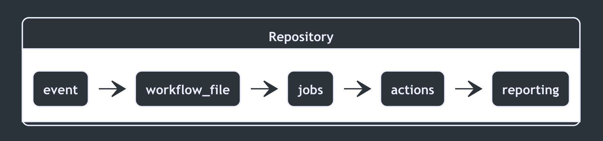

## So how does this all work? 🤔{docsify-ignore-all}

From 30,000 feet GitHub Actions is made up of the following components, with each component having its own complexities:

    

| Component           | Description                                                                                                                                                                                                                                                                                                       |
| ------------------- | ----------------------------------------------------------------------------------------------------------------------------------------------------------------------------------------------------------------------------------------------------------------------------------------------------------------- |
| Action              | Individual tasks that you combine as **steps** to create a **job**. **Actions** are the smallest portable building block of a workflow. To use an **action** in a workflow, you must include it as a step.                                                                                                    |
| Artifact            | <b>Artifacts</b> are the files created when you build and test your code. <b>Artifacts</b> might include binary or package files, test results, screenshots, or log files. <b>Artifacts</b> can be used by the other <b>jobs</b> in the workflow or deployed directly by the <b>workflow</b>.                     |
| Event               | A specific activity that triggers a <b>workflow</b> run.                                                                                                                                                                                                                                                          |
| Job                 | A defined task made up of <b>steps</b>. Each <b>job</b> is run in a fresh instance of the <b>virtual environment</b>. <b>Jobs</b> can run at the same time in parallel or be dependent on the status of a previous <b>job</b> and run sequentially.                                                               |
| Runner              | Any machine with the GitHub Actions <b>runner</b> application installed. You can use a <b>runner</b> hosted by GitHub or host your own <b>runner</b>. A <b>runner</b> waits for available <b>jobs</b>. <b>Runners</b> run one <b>job</b> at a time reporting the progress, logs, and final result back to GitHub. |
| Step                | A <b>step</b> is a set of tasks performed by a <b>job</b>. <b>Steps</b> can run <b>commands</b> or <b>actions</b>.                                                                                                                                                                                                |
| Virtual Environment | The <b>virtual environment</b> of a GitHub-hosted <b>runner</b> includes the virtual machine's hardware configuration, operating system, and installed software.                                                                                                                                                  |
| Workflow            | A configurable automated process that you can set up in your repository. <b>Workflows</b> are made up of one or more <b>jobs</b> and can be scheduled or activated by an <b>event</b>.                                                                                                                            |
