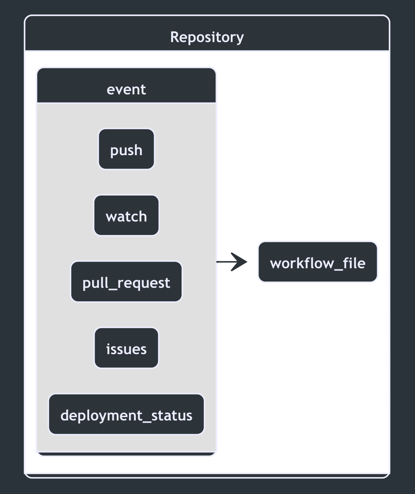

## Events {docsify-ignore-all}

<a id="events" style="cursor: default; text-decoration:none;">
<h4 align="center"> Events trigger workflows </h4>
</a>

<p align="center">
    
</p>

### Webhook event types and payloads

GitHub repository webhooks use event names to identify which event triggered any given webhook. These events can be used to define when a workflow is executed within a repository as well.

### Finding events

The best place to look for events that can be used to trigger workflows is at the [**events that trigger workflows**](https://docs.github.com/en/free-pro-team@latest/actions/reference/events-that-trigger-workflows) documentation.

Finding the proper event name can be a bit tricky so we will look at a couple examples below:

| Event Type                                                                                                                                  | Event Name          |
| ------------------------------------------------------------------------------------------------------------------------------------------- | ------------------- |
| [PushEvent](https://docs.github.com/en/free-pro-team@latest/actions/reference/events-that-trigger-workflows#push)                           | `push`              |
| [PullRequestEvent](https://docs.github.com/en/free-pro-team@latest/actions/reference/events-that-trigger-workflows#pull_request)            | `pull_request`      |
| [IssuesEvent](https://docs.github.com/en/free-pro-team@latest/actions/reference/events-that-trigger-workflows#issues)                       | `issues`            |
| [DeploymentStatusEvent](https://docs.github.com/en/free-pro-team@latest/actions/reference/events-that-trigger-workflows#deployment_status)  | `deployment_status` |
| [WatchEvent](https://docs.github.com/en/free-pro-team@latest/actions/reference/events-that-trigger-workflows#watch)                         | `watch`             |

### Event payloads

The response payload of an event webhook can be used to apply more advanced filtering for a workflow's trigger. An easy example to look at is the [**ProjectEvent**](https://docs.github.com/en/free-pro-team@latest/developers/webhooks-and-events/webhook-events-and-payloads#project).

<p class="custom-info-box">We will explore this further through later hands-on exercises. </p>

| Webhook Name | Activity Types                                                                                           |
| ------------ | -------------------------------------------------------------------------------------------------------- |
| `project`    | <ul><li>created</li><li>updated</li><li>closed</li><li>reopened</li><li>edited</li><li>deleted</li></ul> |

By specifying an event along with an activity type we can build more precise triggers that execute the workflows in a repository:

```yaml
on:
  project:
    type: [created, reopened]
```

---

📖Learn more about [**events that trigger workflows**](https://docs.github.com/en/free-pro-team@latest/actions/reference/events-that-trigger-workflows) and how to use them.
