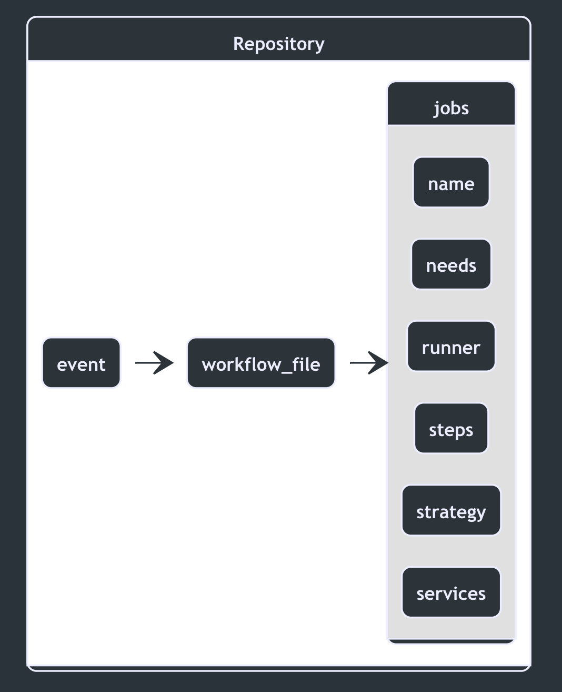

## Jobs {docsify-ignore-all}

<a id="jobs" style="cursor: default; text-decoration:none;">
<h4 align="center"> Jobs define the environment and execution order for steps </h4>
</a>

<p align="center">
    
</p>

### Executable tasks

Until this point, the components we've talked about have been relatively supplementary to the actual unit of work we hope to achieve with a given workflow. It's not until we reach the point of defining jobs that we end up with tangible results.

Jobs, defined in the workflow, have two main purposes:

- Define the environment in which the subsequent steps will run
- Define one or more executable steps.

### All about runners

A major factor at the jobs level is defining the [**runner**](https://help.github.com/en/actions/configuring-and-managing-workflows/configuring-a-workflow#choosing-a-runner) that the job will execute on. To decide the proper runner for your use case, you first need to decide where that runner will be hosted. You have two hosting option for runners:

- [**GitHub Hosted**](https://help.github.com/en/actions/reference/virtual-environments-for-github-hosted-runners#about-github-hosted-runners)
- [**Self Hosted**](https://help.github.com/en/actions/hosting-your-own-runners)

<p class="custom-info-box">For the purposes of this workshop we will be focusing on GitHub Hosted Runners. 

📖For more on insight on the administration of self-hosted runners, see the section [**Opting for Self-hosted Runners**](05.5b_self-hosted-runners.md).</p>

| GiHub Hosted                                                                                                                                                                                                                                                                                                                                                          | Self Hosted                                                                                                                                                                                                                                                                                                                                                                                                                                                                                                                                 |
| --------------------------------------------------------------------------------------------------------------------------------------------------------------------------------------------------------------------------------------------------------------------------------------------------------------------------------------------------------------------- | ------------------------------------------------------------------------------------------------------------------------------------------------------------------------------------------------------------------------------------------------------------------------------------------------------------------------------------------------------------------------------------------------------------------------------------------------------------------------------------------------------------------------------------------- |
| <ul><li>Receive automatic updates for the operating system, preinstalled packages and tools, and the self-hosted runner application.</li><li>Are managed and maintained by GitHub.</li><li>Provide a clean instance for every job execution.</li><li>Use free minutes on your GitHub plan, with per-minute rates applied after surpassing the free minutes.</li></ul> | <ul><li>Receive automatic updates for the self-hosted runner application only. You are responsible updating the operating system and all other software.</li><li>Can use cloud services or local machines that you already pay for.</li><li>Are customizable to your hardware, operating system, software, and security requirements.</li><li>Don't need to have a clean instance for every job execution.</li><li>Are free to use with GitHub Actions, but you are responsible for the cost of maintaining your runner machines.</li></ul> |

Defining a runner is quite easy, and can be done so by specifying the desired runner within the jobs section of the workflow.

```yaml
runs-on: ubuntu-latest
```

📖See a [**full list**](https://help.github.com/en/actions/reference/virtual-environments-for-github-hosted-runners#supported-runners-and-hardware-resources) of runners and their environments
