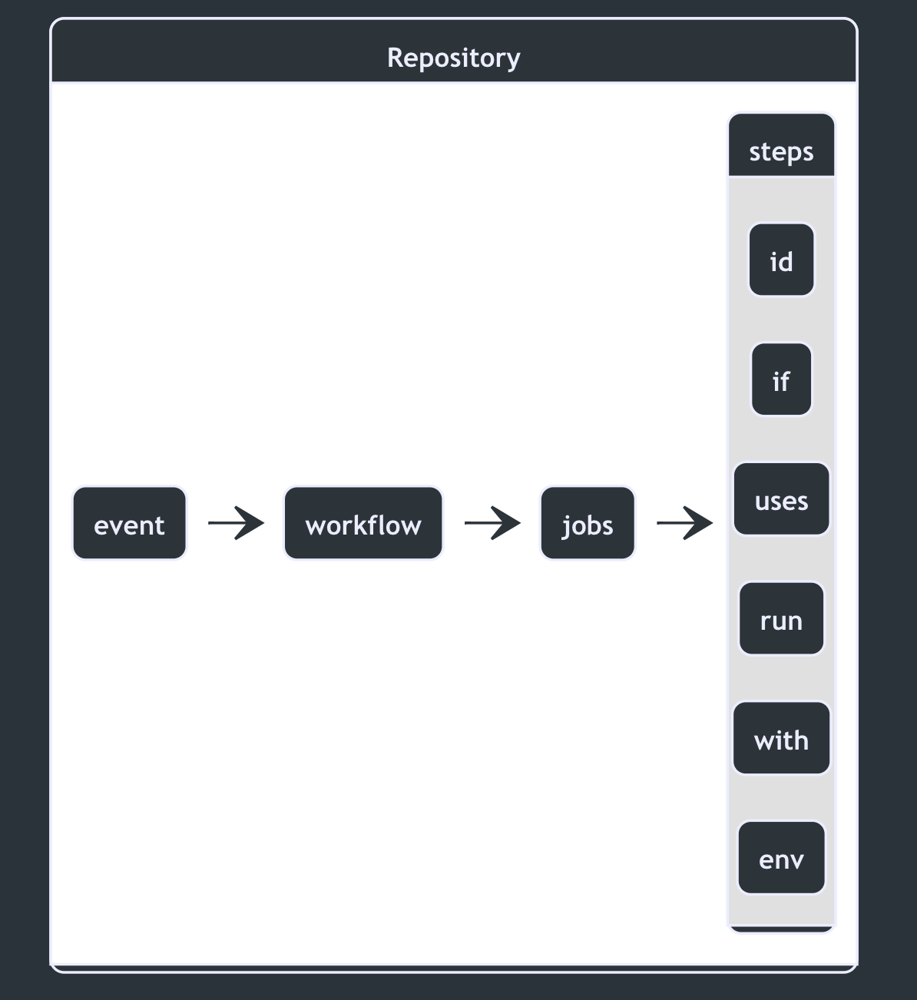
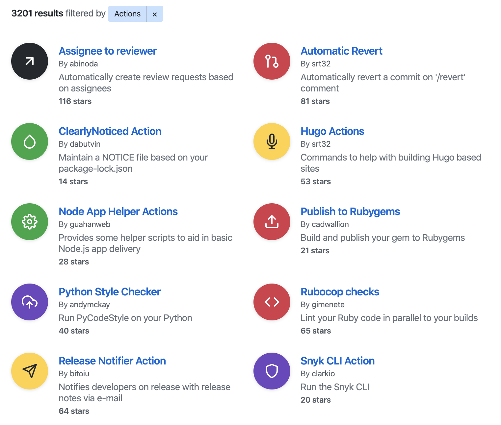

## Steps {docsify-ignore-all}

<a id="steps" class="custom-header">
<h4 align="center"> A job contains a sequence of tasks called steps, our actual units of work in a workflow</h4>
</a>

<p align="center">
    
</p>

### Where the magic happens

Steps are used to carry out the desired logic of the workflows within a repository. There are two step "types":

- Actions (not to be confused with GitHub Actions)
- Commands (commands run from a the runners terminal such as `ping`)

Both of these "types" may be mixed and matched within a single job.

```yaml

jobs:
  my-job:
    steps:
    # My first step uses an action
    - name: My first step
        uses: monacorp/action-name@master
        with:
        some_input: some input value

    # My backup step uses a command
    - name: My backup step
        if: failure()
        run: echo "Oops, something went wrong"
```

### Where do I find actions?

Actions that can be consumed by your workflows can be found in a few different places. The first, and most prevalent place to find actions, is on the [GitHub Marketplace 🛒](https://github.com/marketplace?type=actions). Here you will find a plethora of actions developed by the open source community as well as first party actions developed by vendors.

<p align="center">
    
</p>

The second place to obtain actions is from **public** repositories across GitHub. You will find countless actions located in public repositories where the owners/maintainers of the action chose to not publish it to the marketplace. [This repository](https://github.com/mattdavis0351/actions) shows an example of public actions that aren't listed to the marketplace, but can be consumed publicly by anyone!

Lastly, you may find yourself needing a some customization and privacy, and for that you will find actions in their third location... directly written in a private repository. These actions are **strictly scoped** to the repository they reside in and are **unable to be shared or published**

### I found an action... now what?

Once you decide on an action to use, you can reference it one of three ways:

```yaml
- uses: actions/setup-node@74bc508 # Reference a specific commit
- uses: actions/setup-node@v1.0 # Reference the major version of a release
- uses: actions/setup-node@master # Reference a branch
```

---

<p class="custom-info-box">
Each step runs in its own process in the runner environment and has access to the workspace and filesystem. Because steps run in their own process, changes to environment variables are not preserved between steps.
</p>
