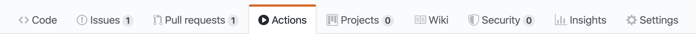
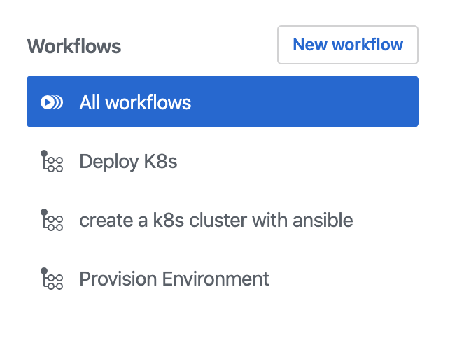
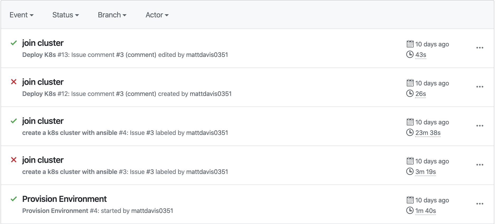
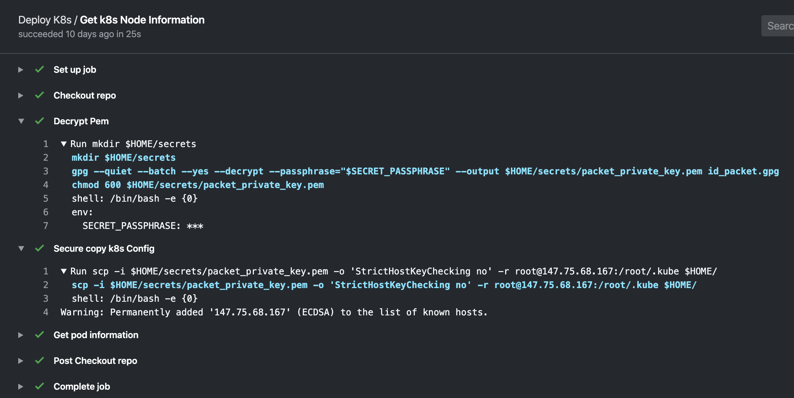

## Reporting {docsify-ignore-all}

The last component of the workflow is to report status back to the repository. GitHub Actions does this in real time and these statuses can be found by going to the **Actions** tab within the desired repository.

    

### View Repository Workflows

From within the actions tab you will be greeted with a super quick overview of the workflows that are currently running in your repository.

    

You will also see a quick status showing successes and failures of most recent runs of a given workflow. Timestamps, branch refs, actors and events that triggered the workflow are also summarized quickly in this view.

    

By clicking on a recent run you will be greeted with even more information about the workflow run. You can continue to drill down through this information until you eventually reach the step-by-step logs that stream in realtime as the workflow executes.

    

 

#### Debugging
Sometimes it can be useful to see extra debug output from your workflows.  To do this you can set the debug secret in the repository.
1. Open Repository Settings
1. Open Secrets
1. Add a new secret with the name `ACTIONS_RUNNER_DEBUG` and the value `true`
1. Notice that new workflows now have extra debug output

---

These logs are also available for download should you need to save them for any reason.

