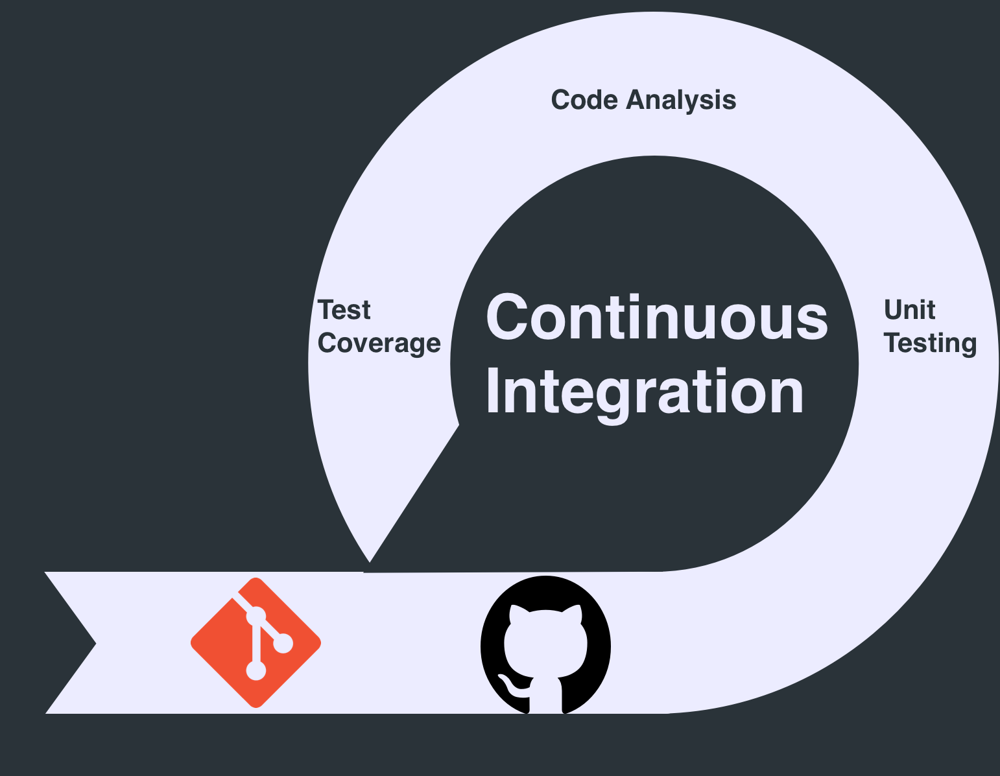

## CI From 30,000ft ✈️ {docsify-ignore-all}

    

### What is CI?

Integration of many changes from different developers into a trunk branch, not necessarily `master`, as early as possible. Ideally these integrations happen many times per day. The aim is to ensure the code an individual developer is working on doesn't divert too much from the rest of the team.

This practice is usually accompanied by a series of automated tests. Although automated testing is not strictly a part of CI, a well oiled CI pipeline will utilize them as much as possible.

### Advantages of Using CI

> Software only becomes valuable when you ship it to customers. Before then it’s just a costly accumulation of hard work and assumptions.
> **\- Darragh Curran, VP of Engineering, Intercom**

| Advantage                  | Explanation                                                                                                                                                                                                                                                                                                                                                                              |
| -------------------------- | ---------------------------------------------------------------------------------------------------------------------------------------------------------------------------------------------------------------------------------------------------------------------------------------------------------------------------------------------------------------------------------------- |
| Reduced Risk               | Frequent testing and deployment of code will eventually reduce risk levels within the project being worked on. Detecting bugs and other code defects will happen sooner in your SDLC. The easier, and sooner, these bugs and defects are found makes them easier and cheaper to fix. Feedback will be amplified and received faster, making communication smoother.                      |
| Better Communication       | With a good CI process in place sharing code becomes easier. Code sharing means more visibility and collaboration between all members of your organization.                                                                                                                                                                                                                              |
| Faster Iterations          | More frequent releases reduces the gap between the application in production and the one in development. A new way to develop features will most likely evolve thanks to every change being tested automatically. The visibility of changes will encourage your team to work in smaller batches, resulting in less assumptions allowing your to build features faster and more reliably. |
| Reduces Manual Testing     | Human error is our number one enemy. Through old, not so well documented manual processes we allow the element of human error to exist within our organizations applications. Automated testing never gets tired or has an off day and therefore is highly reliable once the tests are in place.                                                                                         |
| Early Detection Prevention | Finding bugs and flaws sooner results in higher customer satisfaction and a major reduction in rework from fixing defects that make it to deployment. The earlier these defects are found the more trustworthy the process becomes.                                                                                                                                                      |
