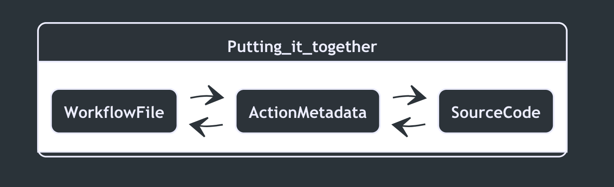

## Action Metadata {docsify-ignore-all}

As we've mentioned before, the `action.yml` sits between the source code of the action and the workflow used to consume the action.

    

### Purpose of the metadata

This file defines three major attributes for any action:

    

👈Let's explore each of these attributes in more detail!
